<div align="center">

# 🛡️ AgentGuard

[](https://www.npmjs.com/package/agent-guard)
[](https://opensource.org/licenses/MIT)
[](https://nodejs.org/)
[](https://github.com/dipampaul17/AgentGuard)

</div>

## 🚨 The Problem

**Your AI agent has a bug. It makes 1000 API calls in a loop. Your $2000 credit card gets charged.**

This happens to developers every week:
- Infinite loops in AI workflows
- Testing with production API keys  
- Agents that don't know when to stop
- One typo = hundreds of dollars gone

**Existing tools only tell you *after* the damage is done.**

## 💡 The Solution

**AgentGuard automatically kills your process *before* it burns through your budget.**

```javascript
// Add 2 lines to any AI project:
const agentGuard = require('agent-guard');
await agentGuard.init({ limit: 50 }); // $50 budget limit

// Your code runs normally until it hits $50, then AgentGuard stops it
const response = await openai.chat.completions.create({...});
```

**Result: Instead of losing $2000, you lose $50 and get a detailed report.**

## 🔄 How It Works

```mermaid
graph TD
    A["🤖 Your AI Agent Starts"] --> B["📦 AgentGuard.init({ limit: $50 })"]
    B --> C["🔍 Monitors All AI API Calls"]
    C --> D["💰 Tracks Real-Time Costs"]
    D --> E{"💸 Cost ≥ $50?"}
    E -->|No| F["✅ Continue Running"]
    E -->|Yes| G["🛑 Emergency Stop"]
    F --> C
    G --> H["📊 Show Savings Report"]
    H --> I["💾 Log Final Statistics"]
    
    style A fill:#e1f5fe
    style B fill:#f3e5f5
    style C fill:#fff3e0
    style D fill:#fff3e0
    style E fill:#ffebee
    style G fill:#ffcdd2
    style H fill:#e8f5e8
```



### Real-Time Monitoring

```mermaid
sequenceDiagram
    participant App as 🤖 Your App
    participant AG as 🛡️ AgentGuard
    participant API as 🔗 AI API
    participant User as 👤 Developer
    
    App->>AG: init({ limit: $50, mode: "throw" })
    AG->>App: ✅ Protection Active
    
    loop Every AI Call
        App->>API: API Request (OpenAI/Anthropic)
        API->>App: Response + Usage Data
        AG->>AG: 💰 Calculate Cost ($0.0243)
        AG->>AG: 📊 Update Total ($47.23 / $50)
        
        alt Cost Under Limit
            AG->>App: ✅ Continue
        else Cost Exceeds Limit
            AG->>App: 🛑 throw AgentGuardError
            AG->>User: 📱 Webhook Notification
            AG->>User: 💰 "Saved you ~$200!"
        end
    end
```



### Protection Modes

```mermaid
graph LR
    subgraph "🛠️ Protection Modes"
        A["mode: 'throw'<br/>🛡️ Safest"]
        B["mode: 'notify'<br/>⚠️ Warning"]
        C["mode: 'kill'<br/>💀 Nuclear"]
    end
    
    subgraph "🎯 When Limit Exceeded"
        A --> D["✅ Throws recoverable error<br/>📝 Allows cleanup<br/>🔄 Graceful shutdown"]
        B --> E["⚠️ Logs warning<br/>📊 Continues monitoring<br/>🚨 Sends notifications"]
        C --> F["💀 process.exit(1)<br/>🚫 Immediate termination<br/>⚡ No cleanup"]
    end
    
    style A fill:#e8f5e8
    style B fill:#fff3e0
    style C fill:#ffebee
    style D fill:#e8f5e8
    style E fill:#fff3e0
    style F fill:#ffebee
```



## Why AgentGuard vs Other Tools?

| Tool | What It Does | When You Find Out About Problems |
|------|-------------|----------------------------------|
| **OpenAI Dashboard** | Shows usage after it happens | Hours later via email |
| **LangChain Callbacks** | Tracks tokens in your code | After script finishes |  
| **tokencost** | Estimates costs beforehand | Before you make calls |
| **AgentGuard** | **Stops execution when limit hit** | **Immediately, mid-execution** |

**AgentGuard is the only tool that actually prevents runaway costs in real-time.**

## Quick Start

### 1. Install

```bash
npm install agent-guard
```

### 2. Add Protection

```javascript
const agentGuard = require('agent-guard');
await agentGuard.init({ limit: 50 }); // $50 budget

// Your existing AI code works unchanged
const response = await openai.chat.completions.create({...});
```

### 3. Watch It Work

```
🛡️ AgentGuard v1.2.1 initialized
💰 Budget protection: $50 (mode: throw)
📊 $12.34 / $50.00 (24.7%) | OpenAI API tracked
🛑 COST LIMIT EXCEEDED - Saved you ~$2000!
```

### Quick Start
```javascript
// Step 1: Add these two lines to your AI agent
const agentGuard = require('agent-guard');
await agentGuard.init({ limit: 25 });  // $25 budget limit

// Step 2: Your existing code works unchanged
const response = await openai.chat.completions.create({
  model: 'gpt-4',
  messages: [{ role: 'user', content: 'Hello world' }]
});
console.log('Response:', response); // ← AgentGuard automatically tracks this

// Real-time protection: 🛡️ $12.34 / $25.00 49.4%
```

### Production Configuration
```javascript
try {
  const guard = await agentGuard.init({
    limit: 100,                              // Budget limit in USD
    mode: 'throw',                          // Safe error vs 'kill' (hard exit)
    webhook: 'https://hooks.slack.com/...',  // Slack/Discord alerts
    redis: 'redis://localhost:6379',        // Multi-process shared budgets
    privacy: true                           // Redact sensitive data
  });
  
  // Your AI agent code here...
  
} catch (error) {
  if (error.message.includes('AGENTGUARD_LIMIT_EXCEEDED')) {
    console.log('Budget protection activated:', error.agentGuardData);
    // Handle gracefully: save state, notify, switch to cheaper model, etc.
  }
}
```

### What You'll See

```bash
--------------------------------------------------
🛡️ AgentGuard v1.2.0 initialized
💰 Budget protection: $25 (mode: throw)
📡 Monitoring: console.log, fetch, axios, undici, got
--------------------------------------------------

$0.23 / $25.00 0.9%     # Real-time cost tracking
$2.45 / $25.00 9.8%     # Updates with each API call  
$20.10 / $25.00 80.4%   # Warning at 80%
$24.89 / $25.00 99.6%   # Danger at 90%

🛑 AGENTGUARD: COST LIMIT EXCEEDED - Saved you ~$75.00
💰 Total cost when stopped: $24.89
📊 Budget used: 99.6%
🛡️ Mode: throw - gracefully stopping with recoverable error
```

## 💡 **Real-World Examples**

### Development Protection
```javascript
// Protect development scripts from expensive mistakes
await agentGuard.init({ limit: 10, mode: 'throw' });
// Safely experiment with AI without surprise bills
```

### Production Deployment
```javascript
// Multi-process protection with Redis
await agentGuard.init({
  limit: 1000,
  mode: 'throw',
  redis: 'redis://production:6379',
  webhook: 'https://hooks.slack.com/alerts'
});
```

### Browser Applications
```html
<script src="https://unpkg.com/agent-guard@latest/dist/agent-guard.min.js"></script>
<script>
  AgentGuard.init({ limit: 50, mode: 'notify' });
  // Your browser AI agent runs with cost protection
</script>
```

### Dynamic Budget Management
```javascript
const guard = await agentGuard.init({ limit: 100 });

// Check costs anytime
console.log(`Spent: $${guard.getCost()}`);

// Adjust for high-priority tasks
if (urgentTask) guard.setLimit(500);

// Reset for new session
await guard.reset();
```

## 🎯 **Live Protection Examples**

See AgentGuard prevent real runaway costs:

```bash
# Runaway loop protection (simulates infinite AI loop)
node examples/runaway-loop-demo.js

# Real customer workflow with budget protection
node examples/real-customer-demo.js

# LangChain integration example
node examples/langchain-example.js

# Interactive browser demo
open examples/test-browser.html
```

**What you'll see**: Real-time cost tracking, automatic protection activation, and graceful error handling that saves money.

## 🔧 **How Real-Time Protection Works**

### Automatic AI API Interception
No code changes needed - AgentGuard automatically monitors:
- **fetch()** - Global HTTP request interception
- **axios** - Automatic response processing
- **undici/got** - Modern Node.js HTTP clients  
- **console.log()** - API response detection in logs
- **http/https** - Raw Node.js request monitoring

### Accurate Cost Calculation
- **Real tokenizers**: OpenAI's `tiktoken` + Anthropic's official tokenizer
- **Live pricing**: Fetches current rates from community sources
- **Streaming support**: Accumulates tokens from partial responses
- **Multimodal**: Handles images, audio, and complex content
- **Smart fallback**: Accurate estimation when tokenizers unavailable

### Protection Activation
1. **Real-time tracking**: Every API call updates budget
2. **Threshold warnings**: Visual alerts at 80% and 90%
3. **Limit enforcement**: Automatic protection when budget exceeded
4. **Graceful handling**: Throws catchable error vs hard process exit
5. **Cost data**: Detailed breakdown for recovery decisions

**Supports all major providers**: OpenAI, Anthropic, auto-detected from URLs

## 📊 What Gets Protected

- 🛡️ **Infinite loops** calling AI APIs
- 🛡️ **Expensive model calls** (GPT-4, Claude Opus)
- 🛡️ **Recursive agent calls** with bugs
- 🛡️ **Development workflows** with cost oversight
- 🛡️ **Runaway RAG** document processing

## 🔒 **Security & Reliability**

### Privacy Protection
```javascript
await agentGuard.init({
  privacy: true,    // Redacts request/response content from logs
  silent: true      // Disables cost display for sensitive environments
});
```

- **Data redaction**: Request/response bodies marked as `[REDACTED]`
- **URL filtering**: Sensitive API endpoints optionally hidden
- **Local operation**: No data sent to external services
- **Memory safety**: Automatic cleanup of sensitive data

### Failure Mode Safety
```javascript
// Graceful degradation (recommended)
mode: 'throw'    // Throws catchable AgentGuardError
mode: 'notify'   // Warns but continues execution  
mode: 'kill'     // Hard process termination (use sparingly)
```

**Why soft failures matter:**
- ✅ Preserves database transactions
- ✅ Allows graceful cleanup
- ✅ Enables error recovery
- ✅ Protects worker threads

### Multi-Process Protection
```javascript
await agentGuard.init({
  redis: 'redis://localhost:6379',  // Shared budget across processes
  limit: 100                        // Combined limit for all instances
});
```

## 🛠️ **API Reference**

### `init(options)`
Initializes AgentGuard with the specified options.

```javascript
const agentGuard = require('agent-guard');
const guard = await agentGuard.init({
  limit: 50,                               // Cost limit in USD
  mode: 'throw',                          // 'throw' | 'notify' | 'kill'
  webhook: null,                          // Webhook URL for notifications
  redis: null,                            // Redis URL for multi-process tracking
  privacy: false,                         // Redact sensitive data
  silent: false                           // Hide cost updates
});
```

### Guard Instance Methods
```javascript
// Cost monitoring
guard.getCost()        // Current total cost
guard.getLimit()       // Current budget limit
guard.getLogs()        // Detailed API call history

// Budget management  
guard.setLimit(200)    // Update budget limit
guard.reset()          // Reset costs to $0

// Configuration
guard.setMode('notify') // Change protection mode
guard.updatePrices()   // Refresh live pricing data
```

## 🤝 Contributing

We love contributions! See our [Contributing Guide](CONTRIBUTING.md) for details.

```bash
git clone https://github.com/dipampaul17/AgentGuard.git
cd AgentGuard
node verify-installation.js
```

## 📜 License

MIT - Use anywhere, even commercial projects.

## 📞 **Support**

- 🐛 **Bug Reports**: [GitHub Issues](https://github.com/dipampaul17/AgentGuard/issues) 
- 💬 **Questions**: [GitHub Discussions](https://github.com/dipampaul17/AgentGuard/discussions)
- 📖 **Documentation**: [API Reference](API.md) • [Quick Start](QUICKSTART.md)

## 📦 **What's Included**

- ✅ **Real-time protection** - Autonomous cost prevention that actually works
- ✅ **Production ready** - TypeScript definitions, browser support, Redis integration
- ✅ **Live examples** - LangChain integration, runaway protection demos
- ✅ **Comprehensive docs** - API reference, security guide, comparison analysis

---

**AgentGuard: The only tool that stops AI runaway costs before they happen.**

*Real-time budget enforcement • Graceful error handling • Zero code changes*

[⭐ Star on GitHub](https://github.com/dipampaul17/AgentGuard) • [📦 Install from NPM](https://npmjs.com/package/agent-guard) • [📊 See Comparison](COMPARISON.md)